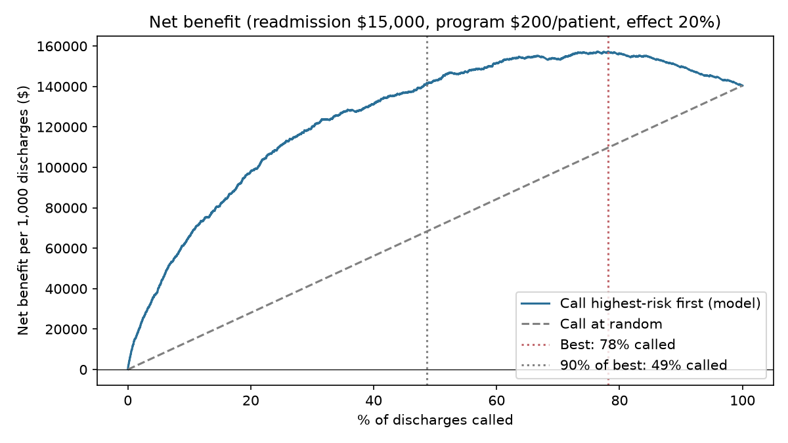

# Hospital Readmission Risk: Who Should a Follow-up Program Call?

[](https://readmission-planner.streamlit.app)

**Live app:** https://readmission-planner.streamlit.app

Predicts 30-day readmission for diabetic inpatients and turns the scores into a staffing decision: how many discharged patients a follow-up program should call, what it costs, how many readmissions it prevents, and who the policy misses.

**Interactive dashboard (Tableau Public):** [Hospital Readmission Follow-up Planner](https://public.tableau.com/views/HospitalReadmissionFollow-upPlanner/Planner)
**Local app (Streamlit):** `streamlit run app.py` for the program planner, a call list and per-patient explanations with what-if re-scoring

## Results at a glance

| | Result |
|---|---|
| Data | UCI Diabetes 130-US Hospitals (1999–2008), 99,340 encounters after leakage exclusions, 40 features |
| Model | Tuned LightGBM with sigmoid calibration, evaluated on a held-out test set **split by patient** |
| Discrimination | ROC-AUC **0.682**, PR-AUC **0.242** (logistic baseline 0.671 / 0.219; random 0.113) |
| Top 10% riskiest | 28.6% are readmitted (2.5x the base rate) and they hold 25.2% of all readmissions |
| Calibration | Mean predicted 11.4% vs actual 11.3%, so scores can be read as probabilities |
| Top drivers (SHAP) | Discharge disposition and prior inpatient visits |
| Best program size* | Call the riskiest **78%** of discharges: $157,235 net benefit per 1,000 discharges; 49% gets 90% of that |
| Realistic 10% program* | 5.7 readmissions prevented per 1,000 discharges at $3,499 each; **4.7x** the net benefit of calling at random |
| Fairness gap | At 10% capacity the list catches **17.6%** of readmissions among patients 80+, against 27.2% for under-80s |

*Assumptions: $15,000 per readmission, $200 per patient enrolled, program prevents 20% of readmissions among those called. All three are adjustable in the dashboard and the app; the sensitivity analysis shows the program pays off in every scenario tested.



## Approach

1. **Data audit** (`01_data_audit`): defined the 30-day target (11.2%), removed encounters ending in death or hospice (they cannot be readmitted), and planned a split by `patient_nbr`, because many patients appear more than once and an encounter-level split leaks.
2. **Cleaning and features** (`02_clean_features`): grouped ICD-9 codes into clinical categories, built prior-visit totals and medication-change counts, and converted age to a number.
3. **Baseline** (`03_baseline_model`): logistic regression, with 5-fold cross-validation grouped by patient.
4. **LightGBM** (`04_lightgbm`): randomized search optimising PR-AUC, then sigmoid calibration on a separate patient-grouped hold-out. Isotonic calibration was tried first and dropped because it created tied scores that hurt ranking.
5. **Explainability and fairness** (`05_explainability_fairness`): SHAP drivers, and ROC-AUC, calibration and top-10% recall by sex, age and race. Payer code is flagged as a possible income proxy.
6. **Decision analysis** (`06_decision_analysis`): net benefit for every call-list size, a break-even risk derived from the calibrated probabilities (6.7%, matching the best share found on the data), capacity scenarios, a cost × effect sensitivity grid, patient-level bootstrap intervals, a decision curve and an equity check.
7. **Tableau export** (`07_tableau_export`): flat CSVs in `tableau/` that drive the parameter-based dashboard.

## Limitations

- The program effect (20%) is a planning assumption, not estimated from this data. A pilot should measure it.
- Net benefit is from the payer / health-system view. A hospital's own finances depend on its payment model and readmission penalties.
- The data is from 1999–2008 and has no labs, vitals or clinical notes, which caps performance (published results on this dataset sit around 0.64–0.70 ROC-AUC).
- The model ranks patients aged 80+ least well (ROC-AUC 0.601), so a single ranked list under-serves them at small program sizes.

## Repository

```
01_data_audit.ipynb ... 07_tableau_export.ipynb   analysis, run in order
app.py, .streamlit/config.toml                    Streamlit planner
figures/, results/                                charts and metrics from each step
tableau/                                          CSVs behind the dashboard
reports/memo.md                                   one-page recommendation
data/ (git-ignored)                               raw data downloads automatically in 01
```

## How to run

```powershell
git clone https://github.com/lavanyakaushik/hospital-readmission-risk.git
cd hospital-readmission-risk
python -m venv .venv
.\.venv\Scripts\Activate.ps1
pip install -r requirements.txt
```

Open the notebooks in VS Code and **Run All** in order (01 downloads the data). Then:

```powershell
streamlit run app.py
```

**Tools:** Python (pandas, scikit-learn, LightGBM, SHAP, matplotlib), Streamlit, Tableau Public.
